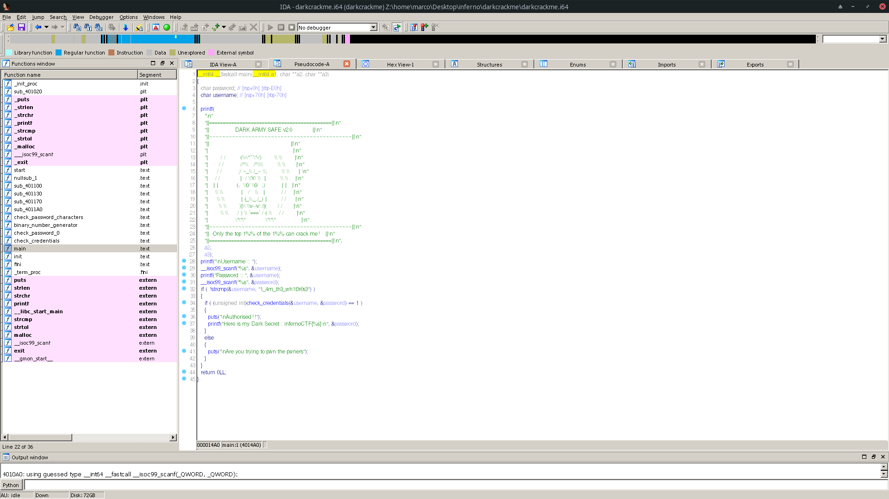
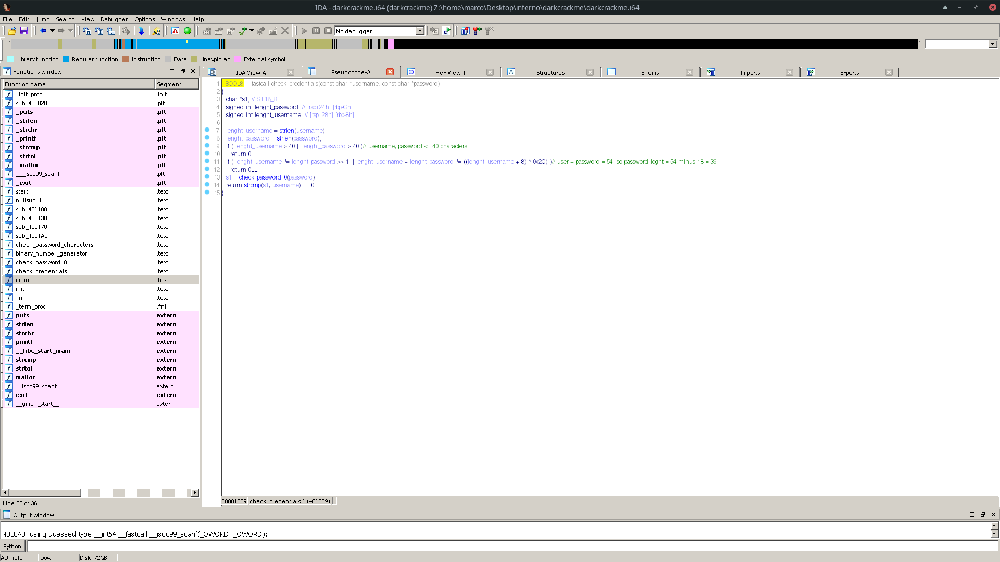
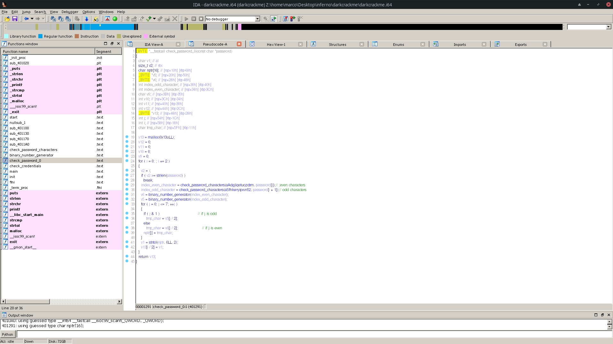
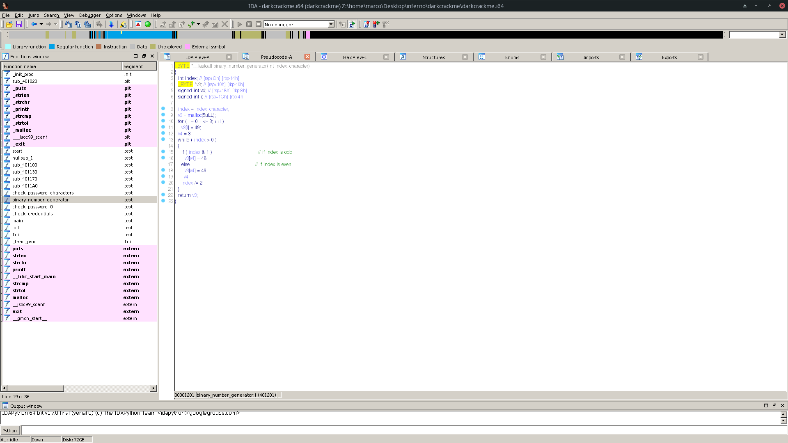

The challenge gives us a program and we need to crack it.
The code isn't obfuscated and could be reversed without problem, so let's start decompile it with IDA PRO.

NOTE: Functions and variables have been renamed by me.

main:



The main takes a username and a password. Then it checks if the username is: *`1_4m_th3_wh1t3r0s3`*.
After that, it calls *`check_credentials`*, and if the function returns 1, it prints the flag (which is the password).

check_credentials:



The function does some check about the leght of the username and password. 
Knowing the username, we discover that the password is 36 characters long.
Then the function calls *`check_password_0`*



The function checks the password 2 caracters at a time with a cycle.
First checks if the characters, even and odd, are between a set of characters and gets the position with function *`check_password_characters`*


set of characters even and odd:
```asm
.data:0000000000404070 aAdgjlqetuozcbm db 'ADGJLQETUOZCBM10',0 ; DATA XREF: check_password_0+55↑o   //even
.data:0000000000404081                 align 10h
.data:0000000000404090 aSfhkwryipxvn52 db 'sfhkwryipxvn5238',0 ; DATA XREF: check_password_0+7C↑o   //odd
```
then it calls *`binary_number_generator`* to generate 4 bits from the even character index and 4 from the odd. Then combines them together and generates a character of the returning string (which must corresponds to a username character).

*`binary_number_generator`*:



The function creates a sequence of 4 "1". Then starts dividing the index in half until it is 0. For each iteration, starting from the bottom of the vector of "1" and going up at each iteration, if the index is odd, changes the value to 0, otherwise keeps 1.

Let's write the resolver:

"1_4m_th3_wh1t3r0s3" in binary:

```bin
00110001 01011111 00110100 01101101 01011111 01110100 01101000 00110011 01011111 01110111 01101000 00110001 01110100 00110011 01110010 00110000 01110011 00110011
```
Every caracter's even bit in vector_even[][4], odd in vector_odd[][4].
C resolver:

```c
#include <stdio.h>


int check_vector(int *v1, int *v2){
	int i;
	
	for(i=0; i<4; i++){
		if(v1[i] != v2[i])
			return 0;
	}
	return 1;
}


int find_index(int *vector){
	int i, n, v4, index;
	int v3[4];
	
	for(n=0; n<16; n++){
		index = n;
		for ( i = 0; i <= 3; ++i )
		      v3[i] = 1;
		 v4 = 3;
		 while ( index > 0 ){
		 	if ( index & 1 )                            // if index is odd
				v3[v4] = 0;
		        else                                        // if index is even
			        v3[v4] = 1;
                        --v4;
			index /= 2;
		 }
		
		 if(check_vector(v3, vector)){
		 	return n;
		 }
	}
}

         

int main(){
	char sol_even[16] = "ADGJLQETUOZCBM10";
	char sol_odd[16] = "sfhkwryipxvn5238";
	int i, index;
  
	int vector_even[][4] = {{0,1,0,0},
				{0,0,1,1},
				{0,1,0,0},
				{0,1,1,0},
				{0,0,1,1},
				{0,1,0,0},
				{0,1,1,0},
				{0,1,0,1},
				{0,0,1,1},
				{0,1,0,1},
				{0,1,1,0},
				{0,1,0,0},
				{0,1,0,0},
				{0,1,0,1},
				{0,1,0,1},
				{0,1,0,0},
				{0,1,0,1},
				{0,1,0,1}};
	
	int vector_odd[][4] = {{0,1,0,1},
			       {1,1,1,1},
			       {0,1,1,0},
			       {1,0,1,1},
			       {1,1,1,1},
			       {1,1,1,0},
			       {1,0,0,0},
			       {0,1,0,1},
			       {1,1,1,1},
			       {1,1,1,1},
			       {1,0,0,0},
			       {0,1,0,1},
			       {1,1,1,0},
			       {0,1,0,1},
			       {1,1,0,0},
			       {0,1,0,0},
			       {1,1,0,1},
			       {0,1,0,1}};

	
	for( i=0; i<18; i++){
		index = find_index(&(vector_even[i][0]));
		printf("%c", sol_even[index]);
		index = find_index(&(vector_odd[i][0]));
		printf("%c", sol_odd[index]);
	}
	printf("\n");
	return 0;
}
```

# FLAG

infernoCTF{CvBsCxOwBsCfOiZvBsZsOiCvCfZvZkCnZhZv}
