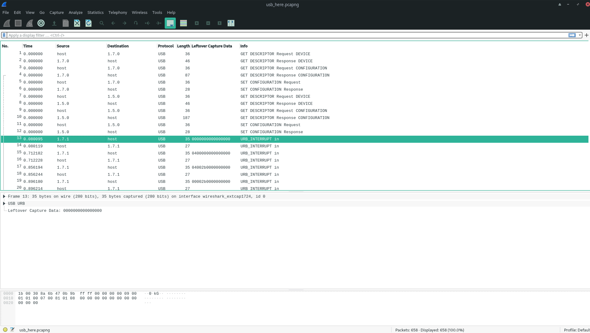
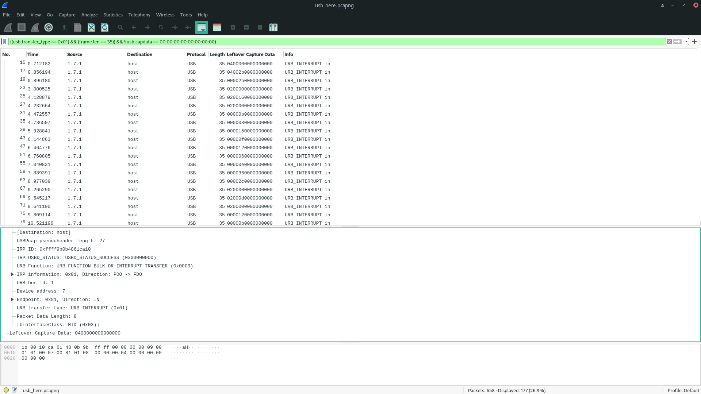
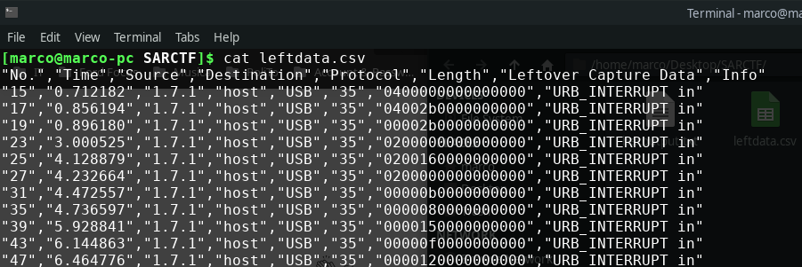
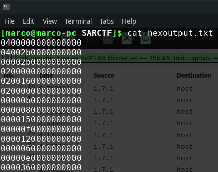

We have been given a pcap file. It contained a usb transfer.



the usb device to ip address 1.7.1 transfer data to the host. Then adding the column "Leftover Capture Data". With a filter like:
```
((usb.transfer_type == 0x01) && (frame.len == 35)) && !(usb.capdata == 00:00:00:00:00:00:00:00)
```
you can only view the packages from the device



Then we have exported the capture as CSV file. The file contains:



With a little bit of bash, we cleaned the file. We got just the data in the coloum "Leftoverdata":

```bash
cat leftdata.csv | cut -d "," -f7 | cut -d "\"" -f2 | grep -vE "Leftover Capture Data" > hexoutput.txt

```



Now with a horrible, minimal (fast to write) python 2 program, we have recovered the mapped keys.

```python
newmap = {
2: "PostFail",
4: "a",
5: "b",
6: "c",
7: "d",
8: "e",
9: "f",
10: "g",
11: "h",
12: "i",
13: "j",
14: "k",
15: "l",
16: "m",
17: "n",
18: "o",
19: "p",
20: "q",
21: "r",
22: "s",
23: "t",
24: "u",
25: "v",
26: "w",
27: "x",
28: "y",
29: "z",
30: "1",
31: "2",
32: "3",
33: "4",
34: "5",
35: "6",
36: "7",
37: "8",
38: "9",
39: "0",
40: "Enter",
41: "esc",
42: "del",
43: "tab",
44: "space",
45: "_",
47: "[",
48: "]",
56: "/",
57: "CapsLock",
79: "RightArrow",
80: "LetfArrow"
}

myKeys = open('hexoutput.txt')
i = 1
for line in myKeys:
    bytesArray = bytearray.fromhex(line.strip())
    for byte in bytesArray:
        if byte != 0: 
            keyVal = int(byte)

            if keyVal in newmap:
                print newmap[keyVal]
            else:
                print "No map found for this value: " + str(keyVal)        

            i+=1
```

# FLAG
```
FLAG{like_a_b100dh0und}
```

