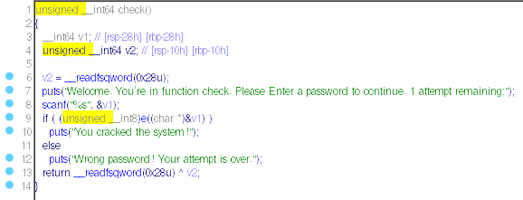
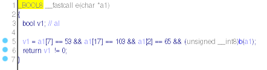
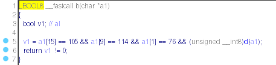
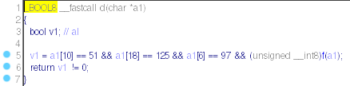
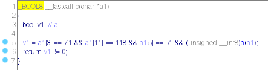
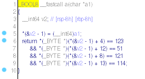

Using ida pro we have decompiled the program. It asks us to enter a password. Then check that each entered character is equal to a specific character (comparing the characters as decimal numbers).
Here are the verification functions:














# FLAG:
```
FLAG{3a5yr3v3r5ing}
```
