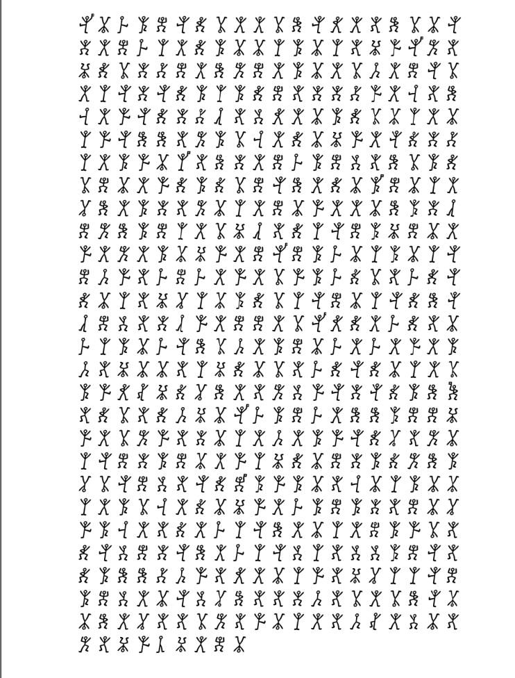

The challenge is made up of an image with stylized men dancing.



Searching online we found the cipher used: "dancing men".
With: https://www.dcode.fr/dancing-men-cipher
the original text is:

```
It was indeed like old times when at that hour I found myself seated beside him in a hansommy revolver in my pocket and the thrill of adventure in my heart Holmes was cold and 
stern and silent As the gleam of the street lamps flashed upon his austere features I saw that his brows were drawn down in thought and his thin lips compressed I knew not
what wild beast we were about to hunt town in the dark jungle of criminal London but I was well as sured from the bear in gof this master hunts man flag disco in Saratov that the 
adventure was a most grave one while the sardonic smile which occasionally broke through his ascetic gloom boded little good for the object of our quest
```
# FLAG
```
FLAG{disco_in_Saratov}
```
