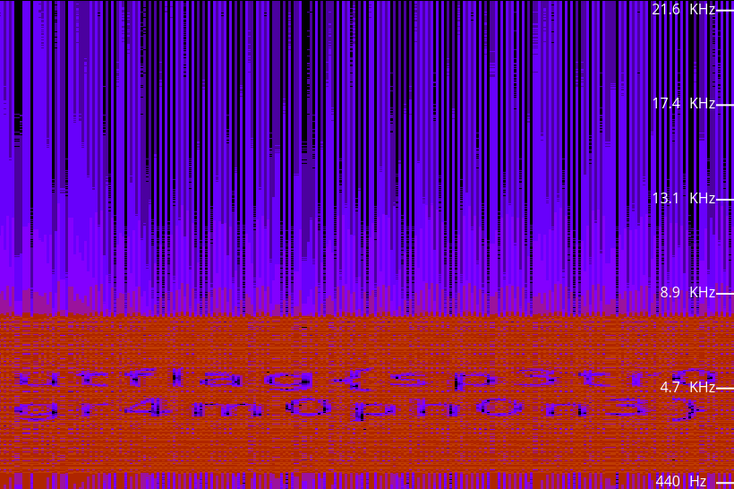

we have been given an audio file. The challenge speaks of spectrum. The spectrum of a signal is the signal itself in the frequency domain. 
So with an online frequency analyzer https://academo.org/demos/spectrum-analyzer/ we got:



# FLAG
```
utflag{spetr0gr4m0ph0n3}
```
