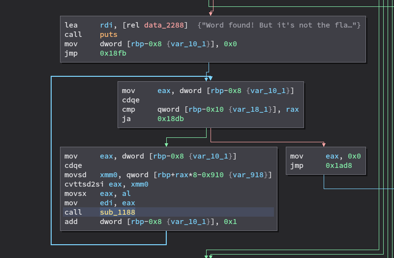
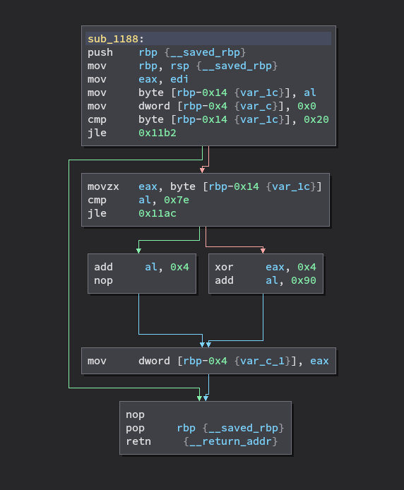

# MAIN
The challenge ask us to insert a string, than it is checked if length is equal to 0x18. In that case it checks if every char correspond to a math equation:

```c
__int64 __fastcall main(int a1, char **a2, char **a3)
{
  __int64 result; // rax
  double v4; // [rsp+10h] [rbp-910h]
  double v5; // [rsp+18h] [rbp-908h]
  double v6; // [rsp+20h] [rbp-900h]
  double v7; // [rsp+28h] [rbp-8F8h]
  double v8; // [rsp+30h] [rbp-8F0h]
  double v9; // [rsp+38h] [rbp-8E8h]
  double v10; // [rsp+40h] [rbp-8E0h]
  double v11; // [rsp+48h] [rbp-8D8h]
  double v12; // [rsp+50h] [rbp-8D0h]
  double v13; // [rsp+58h] [rbp-8C8h]
  double v14; // [rsp+60h] [rbp-8C0h]
  double v15; // [rsp+68h] [rbp-8B8h]
  double v16; // [rsp+70h] [rbp-8B0h]
  double v17; // [rsp+78h] [rbp-8A8h]
  double v18; // [rsp+80h] [rbp-8A0h]
  double v19; // [rsp+88h] [rbp-898h]
  double v20; // [rsp+90h] [rbp-890h]
  double v21; // [rsp+98h] [rbp-888h]
  double v22; // [rsp+A0h] [rbp-880h]
  double v23; // [rsp+A8h] [rbp-878h]
  double v24; // [rsp+B0h] [rbp-870h]
  double v25; // [rsp+B8h] [rbp-868h]
  double v26; // [rsp+C0h] [rbp-860h]
  double v27; // [rsp+C8h] [rbp-858h]
  char s[256]; // [rsp+810h] [rbp-110h] BYREF
  size_t v29; // [rsp+910h] [rbp-10h]
  int j; // [rsp+918h] [rbp-8h]
  int i; // [rsp+91Ch] [rbp-4h]

  if ( ptrace(PTRACE_TRACEME, 0LL, a3) >= 0 )
  {
    puts(
      "\n"
      "  _____ __    _____ _____\n"
      "  |     |  |  |   __|     |\n"
      "  | | | |  |__|   __| | | |\n"
      "  |_|_|_|_____|_____|_|_|_|\n"
      "  v1.0 - Poeta Errante\n"
      "\n");
    puts(
      "  ,-.       _,---._ __  / \\\n"
      " /  )    .-'       `./ /   \\\n"
      "(  (   ,'            `/    /|\n"
      " \\  `-\"             \\'\\   / |\n"
      "  `.              ,  \\ \\ /  |\n"
      "   /`.          ,'-`----Y   |\n"
      "  (            ;        |   '\n"
      "  |  ,-.    ,-'         |  /\n"
      "  |  | (   |            | /\n"
      "  )  |  \\  `.___________|/\n"
      "  `--'   `--'\n"
      "\n");
    puts("~ Help Wesley the cat to find the right word :3 ~\n\n");
    printf("~ Insert a word: ");
    if ( fgets(s, 255, stdin) )
    {
      s[strlen(s) - 1] = 0;
      v29 = strlen(s);
      if ( v29 == 24 )
      {
        for ( i = 0; v29 > i; ++i )
          *(&v4 + i) = (double)s[i];
        if ( v19 == 91.0
          && v22 == 91.0
          && v4 + v4 + 11.0 == v4 + 130.0
          && v27 + v27 + 6.0 == v27 + 127.0
          && 7.0 * v5 == v5 + 396.0
          && v26 == 104.0
          && 3.0 * (v6 + 2.0) - 2.0 == 4.0 * (v6 - 17.0)
          && v25 == v25 + v25 - 44.0
          && v7 == 67.0
          && 3.0 * (3.0 * v24 - 2.0) - 4.0 * (v24 * 5.0 + 2.0) == -8.0 * v24 - 146.0
          && (5.0 * v8 - 2.0) * 5.0 - (v8 + v8 + 7.0) * 6.0 == 33.0 * v8 - 1132.0
          && v23 == v7 + v24 - 16.0
          && (v9 + v9) / 3.0 == (v9 + 44.0) / 3.0
          && v21 == 49.0
          && 0.1666666666666667 * (v10 * 8.0 + 15.0) == 0.5 * (v10 + v10 + 81.0)
          && 0.0 - v20 / 5.0 == 36.0 - v20
          && 7.0 * v11 / 2.0 == v11 * 3.0 + 23.5
          && v18 == v18 / 2.0 + 48.0
          && v12 == 110.0
          && v17 == v18 / 2.0 - 1.0
          && v13 == 104.0
          && v16 == v15
          && v15 == 108.0
          && v14 == 48.0 )
        {
          puts("Word found! But it's not the flag. Awww :3");
          for ( j = 0; v29 > j; ++j )
            sub_1188((unsigned int)(char)(int)*(&v4 + j));
          result = 0LL;
        }
        else
        {
          sub_1175();
          result = 1LL;
        }
      }
      else
      {
        puts("Maybe you should search for a different length word! Meeoww");
        result = 1LL;
      }
    }
    else
    {
      puts("Insert a word");
      result = 0LL;
    }
  }
  else
  {
    puts("Please, do not use a debugger");
    result = 1LL;
  }
  return result;
```


Provide the string to pass all the checks print "Word found! But it's not the flag. Awww :3" . if we look at assembly level, after that it is actually performed a function that modify every charcter submitted, generating the flag.



function that generate the flag:



# FLAG
`{FLG:0v3rl4pp3d_15_c00l}`