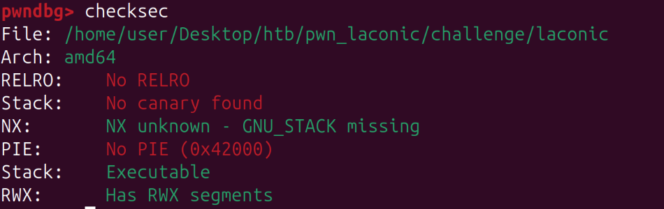
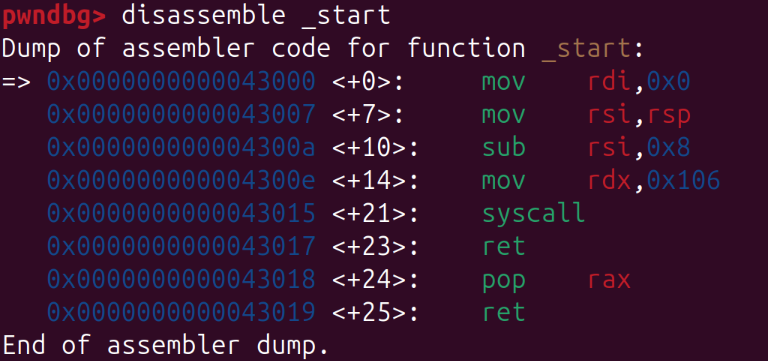
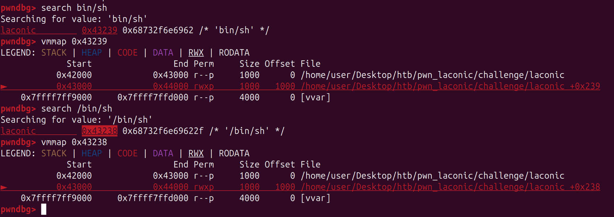

  

`_start` function:

  

There is a stack overflow and a *pop rax* gadget. We can use this gadget to choose which syscall to execute.  
By setting `rax = 15`, we can trigger `sigreturn` and perform **SROP** to open a shell.  
We need a `/bin/sh` string (or an equivalent one) at a known address or at a "leakable" address.

`/bin/sh` string:

  

We obtained that address because there is no **PIE**.  
Thus, we can perform **SROP** by returning to the syscall address and executing a `sigreturn` with the prepared frame.

See the full exploit code here: [exploit.py](./exploit.py)
