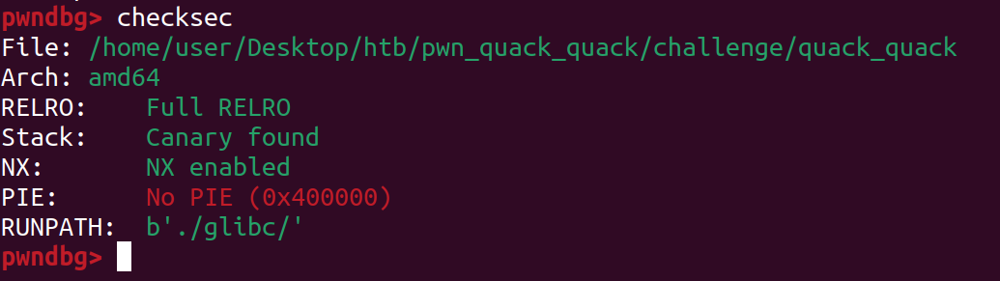
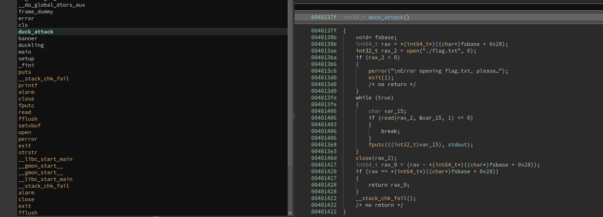
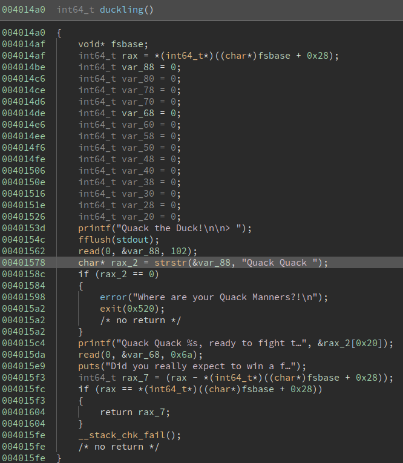

checksec:

  

There is a "winning function" that prints the flag:

  

The program uses *strstr* that returns the pointer to the first occurrence of the string. Then adds 0x20 and use it to print data.

  

By filling the first read with 89 bytes then 'Quack Quack ' + fill the buff, print will actually leak the canary.
with the second read we can overflow, overwrite the canary and modify the last 2 bytes of ret to jump to the winning function.

See the full exploit code here: [exploit.py](./exploit.py)
