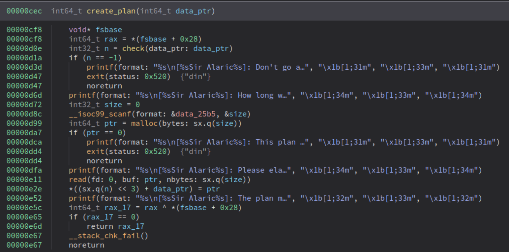
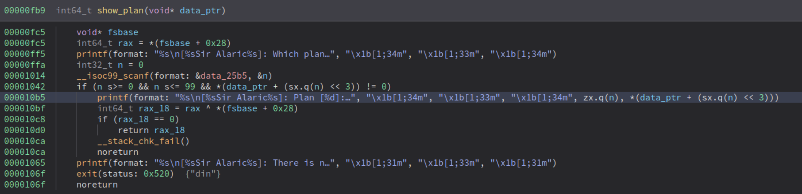
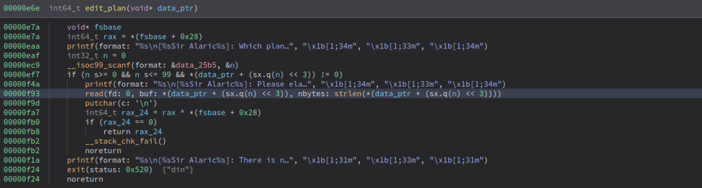

We can allocate, modify, and delete an "infinite" number of mallocated chunks.  
Allocation uses *read*, so no string terminator is added (nor added later by the program):  

The show function prints until a string terminator is encountered:  

We can exploit this by sending a newline character, which will terminate the *read* function but will not stop the *print* function. This will cause a leak of the forward pointer from:  

- **Tcache (heap leak - DON'T NEED IT):** By freeing a chunk and reallocating it without overwriting the forward pointer (only overwriting one byte for the allocation, which is not important since the last three bytes are fixed—not randomized by ASLR—and we already have the libc).  
- **Unsorted bin (glibc leak):** By filling up the tcache so that the next chunk goes into the unsorted bins, or by freeing a chunk larger than the tcache size, causing it to end up in the unsorted bins.  
  The unsorted chunk will be linked with glibc.  

The edit function performs *strlen* and uses it to determine the input size. By filling up the chunk without a string terminator, we can overwrite the size of the next chunk:  

We can exploit this by performing a **tcache poisoning attack**:  

1. Allocate three chunks.  
2. Use the overflow from the first chunk to increase the size of the next chunk (enough to cover part of the third chunk, 8 byte size + 8 byte forward pointer).  
3. Free the third chunk, then the second chunk into the tcache.  
4. Allocate the second chunk again and use the new, bigger size to overwrite the forward pointer of chunk 5, pointing it to `__free_hook - 8`.  
5. Allocate the third chunk (now the tcache next chunk will point to `__free_hook`).  
6. Allocate a new chunk of the same size as the third one, writing `"/bin/sh\x00"` (which will be the argument for `system`) and then the address of `glibc`'s `system`, which will be stored in `__free_hook`.  
7. Free the last chunk to execute `system("/bin/sh")`.  

See the full exploit code here: [exploit.py](./exploit.py)
